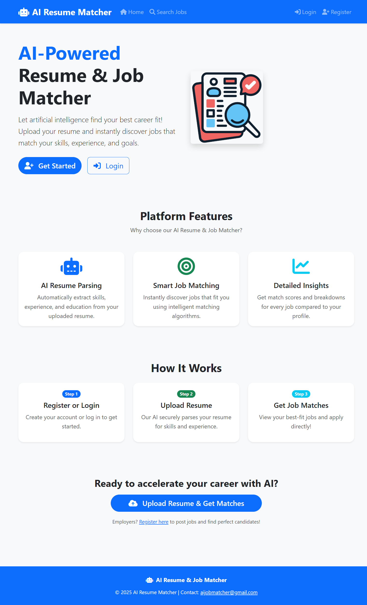
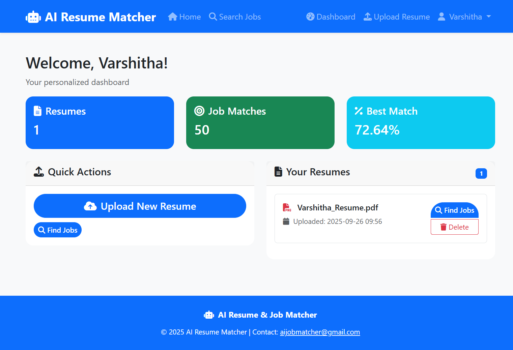
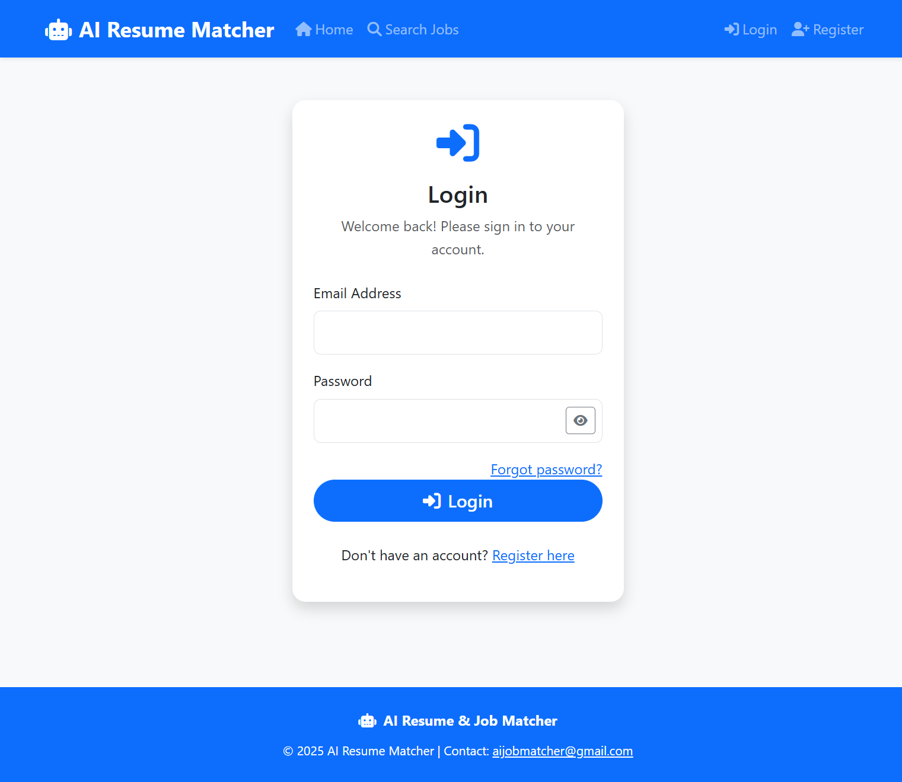
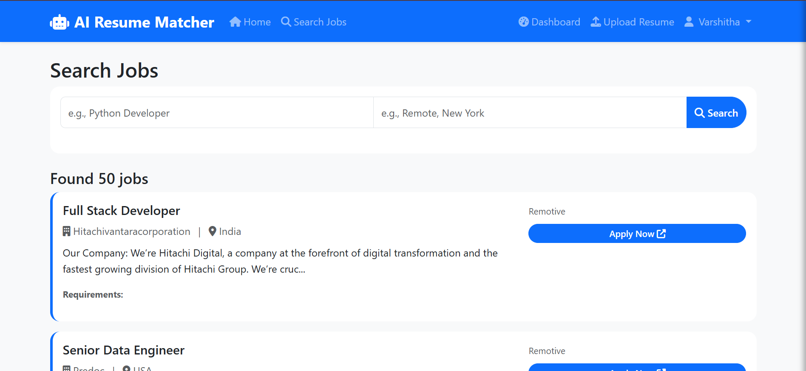
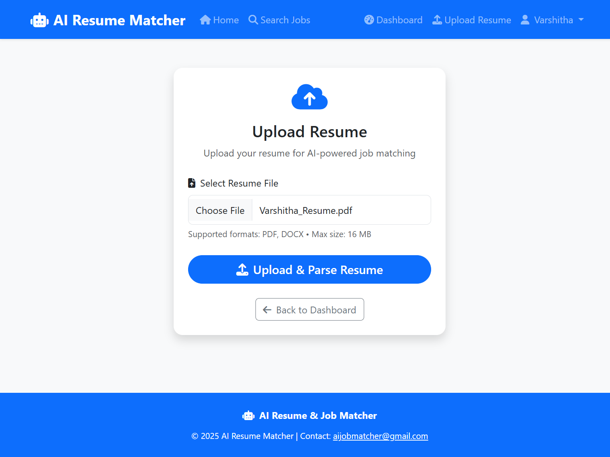
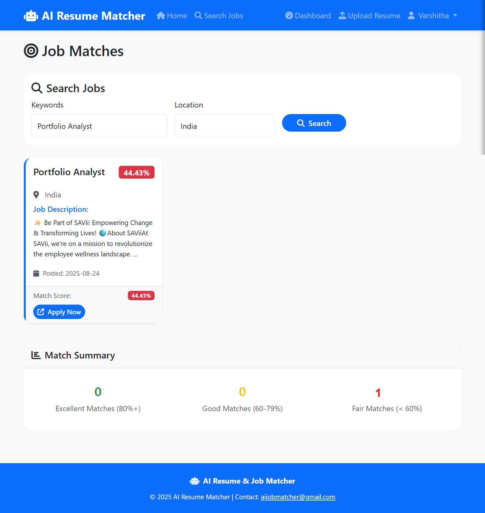

# 🤖 AI Resume Job Matcher

An intelligent web application that uses AI and machine learning to parse resumes and match candidates with relevant job opportunities. Built with Flask, spaCy, and scikit-learn to provide personalized job recommendations based on skills, experience, and qualifications.

## ✨ Features

### For Job Seekers
- **Resume Upload & Parsing**: Upload PDF/DOCX resumes with automatic text extraction
- **AI-Powered Skills Detection**: Extract skills, education, and experience using spaCy NLP
- **Smart Job Matching**: Get personalized job recommendations with match scores
- **Dashboard**: Track applications and view matched jobs

## 🛠️ Technology Stack

- **Backend**: Flask (Python)
- **Database**: PostgreSQL
- **AI/ML**: spaCy, scikit-learn, NLTK
- **Frontend**: HTML5, CSS3, JavaScript, Bootstrap
- **Document Processing**: PyPDF2, python-docx
- **Deployment**: Docker, Gunicorn
- **Email**: Flask-Mail for notifications

## 📋 Prerequisites

- Python 3.8+
- PostgreSQL
- Docker (optional)

## 📁 Project Structure

ai_resume_job_matcher/                                                                                                                                                       
├── app.py # Main Flask application                                                                                                                                          
├── requirements.txt # Python dependencies                                                                                                                                   
├── Dockerfile # Docker configuration                                                                                                                                        
├── schema.sql # Database schema                                                                                                                                             
├── templates/ # HTML templates                                                                                                                                              
│ ├── base.html                                                                                                                                                              
│ ├── index.html                                                                                                                                                             
│ ├── dashboard.html                                                                                                                                                         
│ ├── login.html                                                                                                                                                             
│ └── ...                                                                                                                                                                    
├── static/ # CSS, JS, images                                                                                                                                                
│ ├── css/                                                                                                                                                                  
│ └── js/                                                                                                                                                                    
├── job_fetcher/ # Job data fetching modules                                                                                                                                 
│ ├── job_sources.py                                                                                                                                                         
│ ├── job_updater.py                                                                                                                                                         
│ └── api_sources.py                                                                                                                                                         
├── ai_engine/ # AI/ML processing                                                                                                                                            
│ ├── job_matcher.py                                                                                                                                                         
│ └── resume_parser.py                                                                                                                                                       
└── utils.py # Utility functions                                                                                                                                             

## 📸 Screenshots

### Register Page

### Login Page

### Search Jobs

### Resume Upload

### Job Matches

## 🤝 API Integration

The application supports integration with job boards:
- **Adzuna API**: Local job opportunities

## 📝 Usage

1. **Sign Up**: Create an account as a job seeker or employer
2. **Upload Resume**: Job seekers upload their resume for parsing
3. **View Matches**: AI analyzes resume and suggests relevant jobs
4. **Apply**: Apply to jobs directly through the platform
5. **Track Progress**: Monitor application status in dashboard

## 🚀 Deployment

### Render.com
1. Connect your GitHub repository
2. Set environment variables in Render dashboard
3. Deploy using the provided Dockerfile

## 👨‍💻 Author

**Varshitha Sai N**
- GitHub: [@VarshithaSaiN](https://github.com/VarshithaSaiN)
- LinkedIn: [@VarshithaSaiN](https://www.linkedin.com/in/varshithasain/)

⭐ **Star this repository if you found it helpful!**
